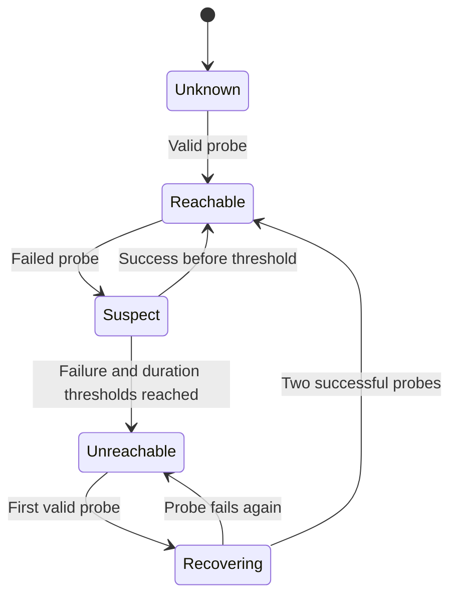

> Subscription update: the implemented UI now uses one `Mitra Alerts` role for all servers and IP changes. See [current setup](peer-uptime-monitoring.md). Per-server roles below describe the original design.

# Peer availability monitoring and dashboard implementation plan

Status: core implementation completed September 8, 2026. Persistent observations,
incident detection, shared settings, role subscriptions, durable alert delivery,
direct observer history replication, retention, graphs and dashboard controls are
implemented. See [setup and implementation details](peer-uptime-monitoring.md).

This document retains the original design for comparison. The shipped version uses
UTC and five-minute duration buckets, with raw observations retained for seven days.
Reporter deduplication uses durable local outboxes and Discord message markers;
outbox rows are not replicated. New replicas catch up on retained raw records and
build their own rollups; expired source records produce explicit gaps. Controls
create refreshed ephemeral dashboards. Operational commands added September 11 include
diagnostics, test alerts, replicated maintenance windows, and an automatically refreshed
shared pinned dashboard. Long-term archive bootstrap, IANA display timezones, an aggregate
multi-observer verdict, DMs, and optional host utilization metrics remain future extensions.
Live two-/three-machine Discord acceptance remains a release validation step.

## Intended experience

Two machines run one visible Discord bot. If A stops responding, B records what it
observes and alerts A's subscribers. More peers add observers/history copies without
requiring a majority vote to report an observation.

| Proposed command | Result |
| --- | --- |
| `/servers status server:server-a hours:24` | Health card and attached history graph, similar to `/ups status`. |
| `/servers dashboard hours:24` | All-server summary and availability timelines, paginated for larger meshes. |
| `/servers incidents server:server-a` | Observed outages/recoveries with observer and timestamps. |
| `/servers subscribe server:server-a` | Add the invoking member's server-specific alert role. |
| `/servers unsubscribe server:server-a` | Remove that role. |
| `/servers alerts channel:<channel>` | Admin sets this guild's alert destination. |
| `/servers monitoring ...` | Admin configures thresholds, intervals and retention. |

Dashboard controls: server selector, 1h/6h/24h/7d window, observer selector and Refresh.
Controls must be reconstructible on any instance. Initially render on-demand Discord
embeds and PNGs using the existing matplotlib dependency. Add optional auto-refresh
of a channel dashboard after rate-limit testing. No hosted website is required.

Example server card:

```text
Server A                  UNREACHABLE FROM SERVER B
Last peer response        42 seconds ago
Discord connection        Unknown (last report: connected)
Process uptime            Last report: 6 days, 3 hours
Observed availability     99.7% over 24h
Observation coverage      98.2% of requested window
Open incident             Since 14:32 UTC; reported by Server B

[peer availability timeline]
[Discord connectivity timeline]
[round-trip latency line with gaps]
```

Do not label a machine physically powered off without external evidence. Process
uptime is not OS uptime; a network failure is not a UPS failure.

## Phase 1: independent collection and durable observations

Add `PeerMonitorTask`, independent of UPS polling and Discord readiness. Proposed
defaults: authenticated probe every 10 seconds, 3-second timeout, three failures
and at least 30 seconds since last success before alerting. Make these configurable.
Use monotonic time for deadlines, UTC for stored/displayed timestamps.

Extend health responses with protocol version, per-boot sequence, last successful
Discord connection time and optional software version. Retain node/boot ID, process
uptime and gateway-connected flag. OS uptime, if added, is a separate optional
platform measurement. Shutdown/maintenance intent is separately reported.

Each observer records receive time, measured RTT, result/reason and the subject's
sample. Distinguish timeouts, authentication failures, certificate expiry and
protocol mismatch. Remote wall clocks must not drive local outage timers; flag skew.

Suggested SQLite tables in the peer database:

| Table | Ownership and contents |
| --- | --- |
| `peer_observations` | Append-only observer-owned events: network, observer ID/boot/sequence, subject, time, result, RTT, subject boot/uptime and gateway state. Unique observer event key. |
| `peer_incidents` | Observer-owned incident ID, subject, first failure, threshold-crossing time, recovery, reason and maintenance state. |
| `peer_health_runtime` | Last success, current state and consecutive failure/success counters. |
| `peer_alert_outbox` | Durable alert ID, incident, destination, payload, attempts/result and Discord message ID. |
| `peer_rollups` | Observer/subject UTC buckets: known-up, known-down, unknown durations and latency summaries. |
| `peer_replication_cursors` | Last imported sequence for each observer boot stream. |

Persist incident transitions and notification intent in one transaction. Do not
reuse the power journal for telemetry. Preserve original event ownership on replicas.

Acceptance: B monitors A without Discord or a UPS; slow USB I/O does not delay probes;
authentication errors are distinct; restart preserves incidents and honest history.

## Phase 2: health states and incidents

Keep peer reachability and reported Discord connectivity separate:



- Use a 60-second startup grace for a configured peer never observed alive; label
  that case separately from a known peer disappearing.
- Record first missed contact and confirmed incident time separately.
- Keep one episode open until recovery; do not ping on every failed probe.
- Require two successful probes for recovery and add a cooldown for rapid flapping.
- Observer downtime becomes **unknown coverage**, not evidence that peers were down.
  Do not bridge long gaps using the observer's last state.
- A answering peers but reporting a disconnected gateway is a Discord-connection
  incident. A not answering peers has unknown/stale gateway status.
- Observers can disagree during partitions. Retain both observations and timestamps
  rather than inventing an authoritative global verdict.

Optional later: each node updates a signed status message in a private Discord
health channel. Fresh Discord activity plus failed peer probes suggests a peer-link
problem. Stale Discord activity does not prove the host is off. This is an extra
observation path, not a lock service or prerequisite for two-node monitoring.

Acceptance: transient loss produces no ping; sustained loss does; recovery closes
one episode; restarts, clock changes and asymmetric links do not invent downtime.

## Phase 3: subscribers and outage/recovery delivery

Use one Discord role per monitored server. Discord owns membership, so B can
mention A's subscribers after A disappears. Store and replicate role IDs and alert
destination mappings; names are presentation, not identity. Send explicit role-only
`allowed_mentions`. Users' Discord settings still determine push notification delivery.

These new network settings need deliberate sharing, unlike legacy local settings.
Replicate configuration changes as immutable records with Discord interaction IDs
and deterministic ordering. Return success after local persistence and report peer
replication pending; reconcile after reconnection. Admin-only configuration;
subscription role add/remove is limited to the invoking member. Concurrent role
creation must reconcile to a chosen role ID and expose duplicates for correction,
not silently split subscribers across roles. Initially use channel alerts; DMs
are a later opt-in requiring per-recipient delivery and privacy handling.

Example:

```text
@Server A Alerts
Server A is unreachable from Server B.
Last successful contact: 14:32:10 UTC
Detected at: 14:32:42 UTC
The machine, Mitra process, or network connection may be unavailable.
```

With two nodes, the remaining observer reports. With more nodes, select a stable
preferred reporter per subject and stagger other observers. Share incident/alert
records and check for an existing open incident message before notifying. Use the
same saved nonce when retrying an alert. Discord's
[`enforce_nonce`](https://docs.discord.com/developers/resources/message#create-message)
only deduplicates recent messages from the same author, so retain durable records
and Discord message IDs too.

This is **best-effort duplicate suppression**, not exactly-once broadcasting.
Partitioned observers may create different incident IDs and send duplicate
observations. Prefer a useful warning over suppressing alerts because a reporter
might have failed. Always identify the observer. Notification responsibility never
confers permission to execute another machine's power actions.

Persist an outbox during Discord outages. If an incident resolves before delivery,
send a historical outage summary with both timestamps instead of a misleading fresh
offline/recovery pair. Treat ambiguous sends separately from definite rejection;
check the saved marker/message ID before retrying and document remaining duplicate risk.

Acceptance: B alerts A's subscribers with A off; reporter restart preserves outbox;
three peers avoid routine duplicates; no unrelated mentions; restored Discord
connectivity yields accurate delayed summaries.

## Phase 4: replication, retention and graphs

Add bounded, authenticated, paginated RPCs to exchange observer streams by cursor.
Validate event ownership and page limits. Repeated pages must be idempotent; copies
keep original observer/event keys. A cursor beyond retained history produces an
explicit gap, not synthetic samples.

Suggested retention: raw 10-second samples for 7 days, 5-minute rollups for 90 days,
incident summaries for 1 year. Make limits configurable. Prune in small transactions
and document disk usage by peer count. Query bounded windows; paginate incidents.
Back up the database rather than sharing a live SQLite file between machines.

Create a matplotlib renderer patterned after `ups_graph.py`:

1. Green/red/gray peer-reachability timeline, with suspect intervals distinguished.
2. Separate Discord connectivity timeline, gray when reports are stale.
3. RTT line only for successful probes; missing samples are gaps, not zero.
4. Process restart/boot-change markers separate from network outages.

CPU, memory and disk utilization can be a later optional panel. Keep these separate
from availability and choose a supported platform collector before adding a dependency;
their absence must never mark a peer offline or prevent an availability graph.

Availability = known-up / (known-up + known-down). Coverage = known duration /
requested duration. Display both and their durations. No known time means `Unknown`.
A 100% availability result with 5% coverage must not look like full-window uptime.
Clip buckets to window boundaries; store UTC and support IANA display timezones.

The dashboard has a row per server and a selected observer or explicit
multi-observer summary. "Reachable from at least one observer" plus a disagreement
marker is useful; do not label it authoritative global uptime. Keep observer,
window, resolution, cache age and coverage visible.

Acceptance: fixtures include healthy, outage, restart, observer downtime, asymmetric
links, empty/all-unknown data, DST and expired retention. Render and visually inspect
PNG results, including a complete multi-server dashboard.

## Delivery and release gate

1. Ship persisted observations and accurate status without notifications.
2. Add incident transitions, shared subscription settings and durable outbox.
3. Add history replication/retention and graph/dashboard controls.
4. Run controlled two- and three-machine acceptance tests and tune thresholds.

Keep alerts opt-in until validated. Test process kill, reboot, peer-link-only outage,
Discord-only outage on one/both nodes, observer restart during an incident and peer
addition/removal. Automated tests mock all power actions. Live tests verify one
visible bot, Gateway event delivery, actual role notifications, rate limits,
recovery durations, persisted graphs and continued operation on the surviving node.
